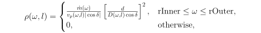
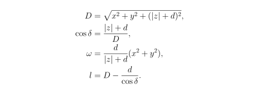
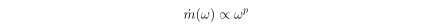
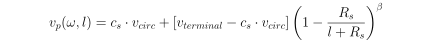

# DGEM


A simple three-dimensional dust continuum radiative transfer code demonstrating directions grid enumeration method advantages.
The method was described in [Shulman (2018)](#shulman2018).

- [DGEM Configuration](#dgem-configuration)
  - [Method Parameters](#method-parameters)
  - [Dust](#dust)
  - [Geometry](#geometry)
  - [Grid](#grid)
  - [Stars](#stars)
  - [Observers](#observers)
  - [Density Slice](#density-slice)
  - [Effective Height](#effective-height)
- [Utils](#utils)
  - [imdiff](#imdiff)
  - [imsum](#imsum)
  - [immean](#immean)
- [Used third-party libraries](#used-third-party-libraries)
- [References](#references)

This code is based on `mcpolar` program by Kenneth Wood (http://www-star.st-and.ac.uk/~kw25/research/montecarlo/montecarlo.html). The code was translated from FORTRAN to C++, refactored and improved. Now it realizes two radiative transfer techniques: Monte Carlo method and directions grid enumeration method (DGEM). DGEM uses precalculated directions of the photons propagation instead of the random ones to speed up the calculations process.

The physics and method detail will be presented in a paper which is in preparation now.

The provided makefile allows compiling the program on Linux.
Cmake configuration can be used to build the program and for IDEs.

PLOT3.plt is a gnuplot script for plotting the resulting images.

In `utils` folder there are utilities to compare images, add them and obtain a mean image.
Utilities are described in section [Utils](#utils).

## DGEM configuration
The first program argument is a configuration file.
If the argument is not provided, the program use parameters.json file.
The configuration file has following sections:

### Method Parameters

Common settings
- fMonteCarlo &mdash; is True or False. Set False for using DGEM or set True for using Monte Carlo method
- fWriteScatterings &mdash; is True or False. The default value is True. Set False to avoid writing single and double scatterings to separate files.
- taumin &mdash; is the minimum optical depth which gives scatterings
- nscat &mdash; number of scatterings considered

Monte Carlo parameters
- nphotons &mdash; total number of photon packets for Monte Carlo method
- iseed &mdash; initialization parameter for random number generator in Monte Carlo method
- inputRandomFile &mdash; a file with the initial state of the random number generator. If it is provided, *iseed* option is ignored.
- outputRandomFile &mdash; a file to store final state of the random number generator

DGEM parameters
- fUseHEALPixGrid &mdash; defines the sphere grid type. Set True to use HEALPix grid ([Gorski et. al. 2005](#gorski2005)).
  Otherwise, a grid based on a partition of a regular icosahedron is used
- PrimaryDirectionsLevel &mdash; the primary directions grid parameter. If *fUseHEALPixGrid* is True the primary directions number is 12 * PrimaryDirectionsLevel ^ 2. Otherwise, it is 5 * 4 ^ PrimaryDirectionsLevel 
- SecondaryDirectionsLevel &mdash; the secondary directions grid parameter. If *fUseHEALPixGrid* is True the primary directions number is 12 * SecondaryDirectionsLevel ^ 2. Otherwise, it is  primary directions number is 5 * 4 ^ SecondaryDirectionsLevel
- NumOfPrimaryScatterings &mdash; number of scatterings in every direction in the primary grid.
                            This parameter should be zero to use optimized one-parameter DGEM.
                            One-parameter DGEM is a recommended mode.
- NumOfSecondaryScatterings &mdash; number of scatterings in every direction in secondary grid
- MonteCarloStart &mdash; number of scatterings of the photon package after which Monte Carlo
                            method is used instead of DGEM (1 is recommended)
- defaultStarRadius &mdash; a default star radius for point sourced used for the inner step computation in one-parameter DGEM method.
                            This parameter is optional. If it is not provided, the solar radius is used.

### Dust

DGEM supports two types of dust now.
- kappa &mdash; The extinction opacity. It is the common dust parameter.

The second Dust description part is "white" or "mie" section.

"white" section corresponds to the dust with [Henyey and Greenstein (1941)](#henyey1941) phase function and
[White (1979)](#white1979) approximation for polarization functions.
It is described by the following parameters:
- albedo &mdash; Single scattering albedo
- hgg &mdash; Henyey-Greenstein phase function anisotropy
- pl &mdash; Peak linear polarization
- pc &mdash; Peak circular polarization
- sc &mdash; Skew Factor

"mie" section describes the dust with tabulated scattering matrix coefficients.
They are usually calculated based on Mie theory.
There are two parameters:
- albedo &mdash; Single scattering albedo
- tableFile &mdash; the path of a file with elements of scattering matrix for Stokes vector (I_r, I_l, U, V). Each line of the file contains a scattering angle in degrees and four coefficients: p1, p2, p3, and p4. Scattering angles from 0 to 180 degrees should be listed in the table in increasing order.

### Geometry

The geometry of the scattering matter is described as a set of geometric shapes. 
On the top level, there are should be flared disk, sphere envelope, fractal cloud or max/sum list.
All angles of this section are measured in degrees, all distances are supposed to be in astronomy units.

#### Flared Disk

The density of the flared disk is described by the following formulae:


where the scale height


and the radial coordinate in the disk plane

.

The model parameters are:
- rInner &mdash; the inner disk radius
- rOuter &mdash; the outer disk radius
- rho0 &mdash; the density at the disk midplane at a radius r0
- h0 &mdash; the disk scale height at a radius r0
- r0 &mdash; the radius, where h0 and rho0 are defined
- alpha &mdash; the radial density exponent
- beta &mdash; the flaring power

##### Safier Wind

One can add the disk wind suggested by Safier ([1993a](#safier1993a), [1993b](#safier1993b)) to the flared disk.
The density of the disk with the wind is the maximum of the wind and disk densities.
The density of the Safier wind is
 


where _&chi; = z / r_ is the dimensionless height above the disk plane and _&rho;<sub>0</sub>_ is the wind density on
the disk surface at distance 1 AU from the star.


The function _&eta;(&chi;)_ can be obtained by solving the gas-dynamic equations.
_&xi;'<sub>0</sub>_ and _&psi;<sub>0</sub>_ are wind model parameters, which are defined in Safier papers ([1993a](#safier1993a), [1993b](#safier1993b)) for a list of models.

The parameters of the wind are:
- model &mdash; the model of the wind from Safier papers. Should be B, C, D, I, E, F or G
- mOut &mdash; the mass outflow rate in solar masses per year
- mStar &mdash; the stellar mass in solar masses
- h0 &mdash; the dimensionless height from which the wind begins
- rMin &mdash; the inner radius of the wind formation region
- rMax &mdash; the outer radius of the wind formation region

##### Kurosawa Wind

The conical disk wind ([Kurosawa, 2006](#kurosawa2006)) may be added to the disk.
the wind density is described depending on _(&omega;, l)_ coordinates.
Here _&omega;_ is the distance from the star to a wind streamline on the equatorial plane,
and _l_ is the distance from the equatorial plane to the point along the streamline.
The wind density is described by the equation:



The relationship between Cartesian coordinates _(x, y, z)_ and wind parameters (_&omega;_, _l_ and others)
is expressed by the following relations:



Here _D_ is the distance from the wind 'source' point to a point with coordinates _(x, y, z)_.
_&delta;_ is an angle between z axis and a streamline.
The local mass outflow rate for _&omega;_ is obtained based on the dependency


and the total mass outflow rate for the wind.

The wind poloidal velocity is expressed by the equation



Here _R<sub>s</sub>_ is the wind scale length, _&beta;_ is the wind acceleration rate,
_c<sub>s</sub>_ is the sound speed in the local disk circular velocity units,
_v<sub>circ</sub>_ is the disk circular velocity at radius &omega;,
_v<sub>terminal</sub>_ is the wind terminal velocity.

In sum, the wind parameters are:
- d &mdash; the distance from the star to a wind 'source' point
- p &mdash; the mass outflow rate on radius dependency power
- mOut &mdash; the mass-loss rate in solar masses per year
- mStar &mdash; the stellar mass in solar masses
- rInner &mdash; the inner radius of the wind formation region in AU
- rOuter &mdash; the outer radius of the wind formation region in AU
- rScale &mdash; the wind scale length in AU
- windAccelerationRate &mdash; the wind acceleration rate
- terminalV &mdash; the wind terminal velocity in km/s
- soundSpeed &mdash; the sound speed at the wind launching point on the disc in the disk circular velocity units

##### Disk Humps

One can add humps based on the Gaussian function to model disk perturbations.
There are two types of humps: a round hump and an azimuthal hump.
Both humps may be applied to the flared disk and Safier wind.
In the case of the disk hump, it is applied to the disk scale height _h_.
In the case of the wind hump it is applied to the density _&rho;_.
Only one hump is allowed for the disk (or wind).
The hump centre is located on the _x_ axis of the disk.

The round hump has a shape


The azimuthal hump has a bit more complicated shape


In this equations _v_ is the value the hump changes and other values are hump model parameters:
- h &mdash; the hump relative height
- r &mdash; the distance from the disk axis to the centre of the hump
- sigma2 &mdash; the variance of the hump mass distribution along the disk plane (for the round hump) or the radius (for azimuthal hump)
- sigma2azimuthal &mdash; the variance of the hump mass distribution along the azimuth for the azimuthal hump
- sigma2azimuthalBackward &mdash; the optional variance of the hump mass distribution along the azimuth for the azimuthal hump. When _sigma2azimuthalBackward_ is provided it is used for negative values of _arctan(y, x)_ and _sigma2azimuthal_ is used only for positive values of _arctan(y, x)_.

#### Sphere Envelope

The density of the sphere envelope is described by the equation


where the radius is
    
.

The model parameters are:
- rInner &mdash; the inner sphere radius
- rOuter &mdash; the outer sphere radius
- rho0 &mdash; the density at a radius r0
- r0 &mdash; the radius, where rho0 is defined
- alpha &mdash; the radial density exponent

#### Fractal Cloud

The fractal cloud suggested by [Elmegreen (1997)](#elmegreen1997) is a clumpy dust cloud, which is obtained by the following algorithm:
1. Consider a cube space with size **2max**, consisting of **n**<sup>3</sup> cubical cells.
2. Place **dotsN** points randomly in the cube. 
3. For every point build a smaller cub with a center in the point. The size of
new cubes is **max**/&Delta;, where &Delta; = **dotsN<sup>1/dCube</sup>**.
**dCube** is the fractal dimension.
4. Place other **dotsN** points randomly in every small cube.
Do not shift any points outside of the considered big cube and use them in the next steps.
5. Repeat steps 3–4 twice more. The total number of created points is **dotsN**<sup>4</sup>.
6. Shift all points outside the big cube to within it by changing point coordinates per **2max**.
7. Set the density in every cell proportional to the number of dots in this cell

The model parameters are:
- n &mdash; the number of cells along each direction of the cube.
- max &mdash; the distance from the cube centre to a cube border along each axis
- dCube &mdash; the fractal dimension
- rho0 &mdash; the density per one dot
- dotsN &mdash; the number of initial dots
- seed &mdash; the seed for a random number generator

#### Sum / Max

The list of other geometry shapes (including other lists).
The density of the sum list is the sum of densities of all elements.
The density of the max list is the maximum density of all elements.

#### Translation

The Flared Disk and the Sphere Envelope may contain additional Translation section.
It describes a rotation and a translation of the shape in the global coordinate system.
We use the Euler angles for rotation.
So there are six parameters: intrinsicRotation, nutation, precession, x, y, z.
Intrinsic rotation, nutation and precession are measured in degrees.
x, y, z are in AU.
All transformations are applied in the global coordinate system, thus the order of operations is:
1. Intrinsic Rotation (rotation around _z_-axis)
2. Nutation (rotation around _x_-axis)
3. Precession (rotation around _z_-axis)
4. (x, y, z) vector translation

Every value may be omitted (it will be treated as zero).

### Grid

Two types of grids are supported: a regular cartesian grid and an unstructured tetrahedral grid.

#### Cartesian grid

The cartesian grid has following parameters __xmax__, __ymax__, __zmax__, __nx__, __ny__, and __nz__.
The studied area is [__-xmax__ : __xmax__] x  [__-ymax__ : __ymax__] x [__-zmax__ : __zmax__] and consists of __nx * ny * nz__ cells.
__nx__, __ny__, and __nz__ are the numbers of cells along each axis.

#### Tetrahedral grid

The tetrahedral grid is based on the Delaunay triangulation.
The area is from __-max__ to __max__ along all axes.
The nodes of the grid are described in the __nodesFile__ and elements are listed in __elementsFile__.
Instead of these two files the grid may be presented in the form of one binary file __gridBinFile__.
If all three files exist, grid from __nodesFile__ and __elementsFile__ will be saved in __gridBinFile__.
The grid may be constructed in a separate programs, e.g. [_gmsh_](https://gmsh.info/) ([Geuzaine and  Remacle, 2009](#geuzaine2009))

The first line of the __nodesFile__ is the number of nodes. All other lines contain four values: node number and _x_, _y_, _z_ coordinates.

The first line of the __elementsFile__ is the number of nodes. All other lines contain five unused values and four node numbers of the tetrahedral vertices.

### Stars
Is a list of sources with 4 parameters:
- x, y, z &mdash; source coordinates
- l &mdash; source luminosity
- r &mdash; optional star radius in AU. The default value is 0. When r > 0 the star is modelled as a sphere source, otherwise as a point source.

```yaml
"stars": [
    {
      "x": 0.0,
      "y": 0.0,
      "z": 0.0,
      "l": 1.0,
      "r": 0.0047
    }
  ]
```

### Observers

We use spherical coordinates [_&theta;_, _&phi;_] to describe the direction towards each observer.
_&theta;_ is a zenith distance (an angle between positive _z_-axis direction and observers direction), measured from 0 to 180&deg;.
_&phi;_ is an azimuth, measured counterclockwise in _xy_ plane from the positive _x_-axis direction.
The azimuth may be in the range from -180&deg; to 180&deg; or from 0 to 360&deg;.

There are four additional parameters to describe the observer.
We specify them once for all observers.
- _rimage_ is a radius of the visible area in astronomy units.
  Both axes of the image will be from -_rimage_ to _rimage_.
- _rmask_ defines the radius in astronomy units of the circular area in the center of the image, which will be covered with a mask (allows you to make an analog of a coronagraph).
  Optional parameter: 0 is the default value.
- _nx_ and _ny_ are optional parameters describing the image size in pixels. The default size is 200x200.

There are three ways to specify observer directions:

#### Manual

One should specify the list of coordinates _&phi;_ and _&theta;_ for each observer position.

#### Parallel

All observers are evenly distributed on the circle with a constant _&theta;_.
In this configuration, one should specify the number of observers _numberOfObservers_ and _&theta;_.
The first observer has _&phi;_ equal to zero.

#### Meridian

All observers are evenly distributed on the meridian with a constant _&phi;_.
In this configuration, one should specify the number of observers _numberOfObservers_ and _&phi;_.
If _numberOfObservers_ is the odd one of the observers has _&theta;_ equal to 90&deg;.
This configuration does not include poles.

#### Example

You can combine all three ways in one problem.
The JSON configuration may be specified in the following way:

```yaml
"observers": {
    "rimage": 800.0,
    "rmask": 0.1,
    "manual": [
      {
        "phi": 45.0,
        "theta": 45.0
      },
      {
        "phi": 60.0,
        "theta": 120.0
      }
    ],
    "parallel": {
      "numberOfObservers" : 10,
      "theta" : 90.0
    },
    "meridian": {
      "numberOfObservers" : 2,
      "phi" : 0.0
    }
  }
```

### Density Slice

It may be important to check that the scattering matter has the geometry you expect in some cases.
For this purpose, the configuration file contains **densitySlice** optional section.
It allows dumping a slice of the scattering medium along the z-axis into a file.
The slice parameters are:
- filename &mdash; the output file name
- phi &mdash; longitude of the slice in degrees
- radiusMax &mdash; the maximum radius value. The radius varies from 0 to _radiusMax_.
- heightMax &mdash; the maximum height value. The height varies from 0 to _heightMax_.

### Effective Height

The effective height is the height (_z_ value) at which the optical thickness of the matter,
when moving downward along the _z_-axis from the infinity, reaches 1.
This value is convenient for understanding the geometric shape of the scattering matter.
This debug output is described in **effectiveHeight** optional section.
The effective height parameters are:
- filename &mdash; the output file name
- radiusMax &mdash; the maximum module of _x_ and _y_ coordinates
- heightMax &mdash; the maximum height value. Integration along the _z_ axis starts from this height
- dRadius &mdash; the step along _x_ and _y_ axes
- dHeight &mdash; the step for integration along the _z_ axis
- printCoordinates &mdash; boolean flag. If it is _true_ each output line contains three values: _x_, _y_ and _z_. Otherwise, only the _z_ values are displayed in the table form.

## Utils

There are three utilities: `imdiff`, `immean`, and `imsum`.
They can be compiled both with makefile `makeutils` and Cmake.

### imdiff

Computes image difference statistics and produces three files: 
`dif.dat` with the image pixel difference,
`dif_abs.dat` with the absolute pixel difference,
and `dif_rel.dat` with the relative pixel difference.
In the output statistics the main value is `refsum`.
It is the difference norm for the images.
```
Usage: ./imdiff [OPTION] FILE1 FILE2
Compare image files FILE1 and FILE2, compute difference norm, and create difference files.
Options:
-h, --help      display this help and exit.
-c, --compute   just compute difference norm and do not create files.
```
### imsum

Computes the sum of images.
May be used to combine image files for different scatterings.
```
Usage: ./imsum [OPTION] FILES -o SUMFILE
Compute sum of images from FILES and store the resulting image into SUMFILE.
Options:
-h, --help  display this help and exit.
```

### immean

Computes the mean of images.
May be used to combine results of different Monte Carlo simulations with equal photon numbers.
```
Usage: ./immean [OPTION] FILES -o MEANFILE
Computes mean of images from FILES and stores the resulting image into MEANFILE.
Options:
-h, --help	display this help and exit.
```

## Used third-party libraries

* **[nlohmann/json](https://github.com/nlohmann/json)** to parse a configuration file
* **[catch2](https://github.com/catchorg/Catch2)** for unit testing

## References

1. <a name="bratley1988"></a>Bratley P. and Fox B.L., 1992. Algorithm 659: Implementing Sobol's Quasirandom Sequence Generator. ACM Trans. Math. Softw. **14**, 88–100. doi:[10.1145/42288.214372](https://doi.org/10.1145/42288.214372)
1. <a name="bratley1992"></a>Bratley P., Fox B.L., and Niederreiter H., 1992. Implementation and Tests of Low-Discrepancy Sequences. ACM Trans. Model. Comput. Simul. **2**, 195–213. doi:[10.1145/146382.146385](https://doi.org/10.1145/146382.146385)
1. <a name="elmegreen1997"></a>Elmegreen B.G., 1997. Intercloud structure in a turbulent fractal interstellar medium. Astrophys. J. **477**, 196–203. doi:[10.1086/303705](https://doi.org/10.1086/303705)
1. <a name="faure1981"></a>Faure H., 1981. Discrépances de suites associées à un système de numération (en dimension un). Bulletin de la S. M. F. **109**, 143–182. doi:[10.24033/bsmf.1935](https://doi.org/10.24033/bsmf.1935)
1. <a name="fox1986"></a>Fox B.L., 1986. Algorithm 647: Implementation and Relative Efficiency of Quasirandom Sequence Generators. ACM Trans. Math. Softw. **12**, 362–376. doi:[10.1145/22721.356187](https://doi.org/10.1145/22721.356187)
1. <a name="geuzaine2009"></a>Geuzaine C. and  Remacle J.-F., 2009. Gmsh: a three-dimensional finite element mesh generator with built-in pre- and post-processing facilities. International Journal for Numerical Methods in Engineering, **79**(11), 1309-1331. doi:[10.1002/nme.2579](https://doi.org/10.1002/nme.2579)
1. <a name="gorski2005"></a>Gorski K.M., Hivon E., Banday A.J., Wandelt B.D., Hansen F.K., Reinecke M., and Bartelmann M., 2005. HEALPix: A Framework for High-Resolution Discretization and Fast Analysis of Data Distributed on the Sphere, Astrophys. J., **622**, 759–771. doi:[10.1086/427976](https://doi.org/10.1086/427976)
1. <a name="halton1964"></a>Halton J. and Smith G. B., 1964. Algorithm 247: Radical-inverse quasi-random point sequence. Commun. ACM **7**, 701–702. doi:[10.1145/355588.365104](https://doi.org/10.1145/355588.365104)
1. <a name="henyey1941"></a>Henyey L.G. and Greenstein J.L., 1941. Diffuse radiation in the Galaxy. Astrophys. J. **93**, 70–83. doi:[10.1086/144246](https://doi.org/10.1086/144246)
1. <a name="james1994"></a>James F., 1994. RANLUX: A Fortran implementation of the high-quality pseudorandom number generator of Lüscher. Computer Physics Communications **79**, 111-114. doi:[10.1016/0010-4655(94)90233-X](https://doi.org/10.1016/0010-4655(94)90233-X)
1. <a name="joe2008"></a>Joe S. and Kuo F.Y., 2008. Constructing Sobol Sequences with Better Two-Dimensional Projections. SIAM Journal on Scientific Computing **30**, 2635–2654. doi:[10.1137/070709359](https://doi.org/10.1137/070709359)
1. <a name="kurosawa2006"></a>Kurosawa R., Harries T. J., and Symington N. H., 2006. On the formation of Hα line emission around classical T Tauri stars. MNRAS **370**, 580–596. doi:[10.1111/j.1365-2966.2006.10527.x](https://doi.org/10.1111/j.1365-2966.2006.10527.x)
1. <a name="lecuyer1988"></a>L'Ecuyer P., 1988. Efficient and Portable Combined Random Number Generators. Commun. ACM **31**, 742–749,774. doi:[10.1145/62959.62969](https://doi.org/10.1145/62959.62969)
1. <a name="luscher1994"></a>Lüscher M., 1994. A portable high-quality random number generator for lattice field theory simulations. Computer Physics Communications **79**, 100–110. doi:[10.1016/0010-4655(94)90232-1](https://doi.org/10.1016/0010-4655(94)90232-1)
1. <a name="matsumoto2000"></a>Matsumoto M. and Nishimura T., "Dynamic Creation of Pseudorandom Number Generators", Monte Carlo and Quasi-Monte Carlo Methods 1998, Springer, 2000, 56–69. doi:[10.1007/978-3-642-59657-5_3](https://doi.org/10.1007/978-3-642-59657-5_3)
1. <a name="niederreiter1988"></a>Niederreiter H., 1988. Low-discrepancy and low-dispersion sequences. Journal of Number Theory **30**, 51–70. doi:[10.1016/0022-314X(88)90025-X](https://doi.org/10.1016/0022-314X(88)90025-X)
1. <a name="park1993"></a> Park S.K., Miller K.W., and Stockmeyer P.K., (1993). "Technical Correspondence: Response". Communications of the ACM. **36**, 108–110. doi:[10.1145/159544.376068](https://doi.org/10.1145/159544.376068)
1. <a name="safier1993a"></a>Safier P. N., 1993a. Centrifugally Driven Winds from Protostellar Disks. I. Wind Model and Thermal Structure. Astrophys. J. **408**, 115. doi:[10.1086/172574](https://doi.org/10.1086/172574)
1. <a name="safier1993b"></a>Safier P. N., 1993b. Centrifugally Driven Winds from Protostellar Disks. II. Forbidden-Line Emission in T Tauri Stars. Astrophys. J. **408**, 148. doi:[10.1086/172575](https://doi.org/10.1086/172575)
1. <a name="shulman2018"></a>Shulman S.G., 2018. Three-dimensional heuristic radiation transfer method based on enumeration using the directions grid. Astronomy and Computing **24**, 104–116. doi:[10.1016/j.ascom.2018.06.002](https://doi.org/10.1016/j.ascom.2018.06.002)
1. <a name="sobol1967"></a>Sobol’ I.M., 1967. Distribution of points in a cube and approximate evaluation of integrals. U.S.S.R Comput. Maths. Math. Phys. **7**, 86–112. doi:[10.1016/0041-5553(67)90144-9](https://doi.org/10.1016/0041-5553(67)90144-9)
1. <a name="white1979"></a>White R.L., 1979. Polarization in reflection nebulae. I. Scattering properties of interstellar grains. Astrophys. J. **229**, 954–961. doi:[10.1086/157029](https://doi.org/10.1086/157029)
